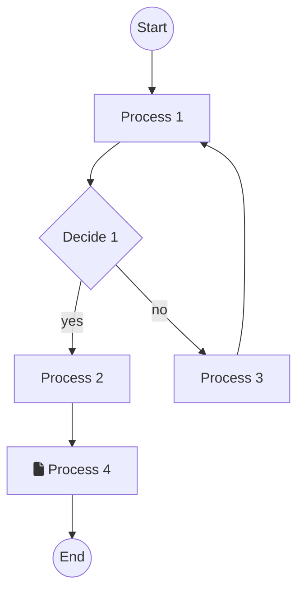

# Mermaid

https://mermaid.js.org/

The best about Mermaid is that it integrates natively with markdown renderring processes on GitHub.

To render in VSCode, use any available extension like `Markdown Preview Mermaid Support`